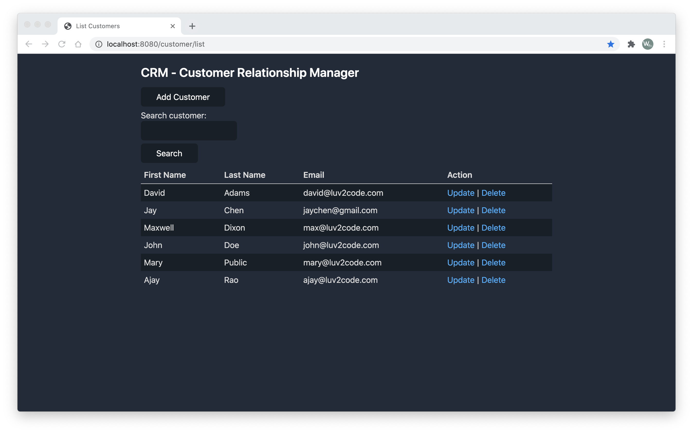
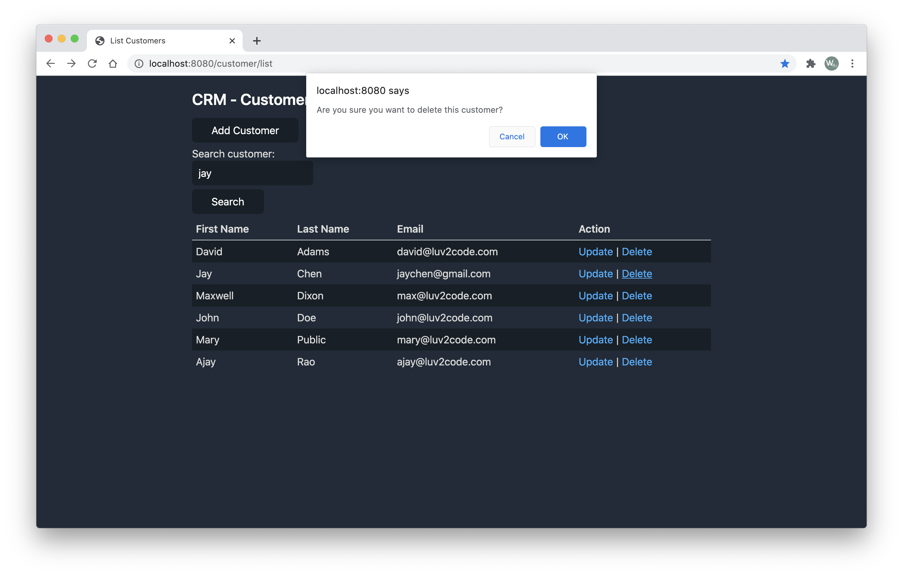
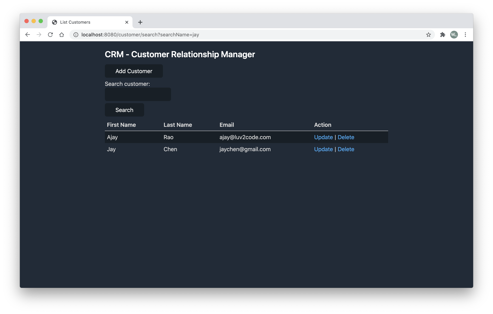
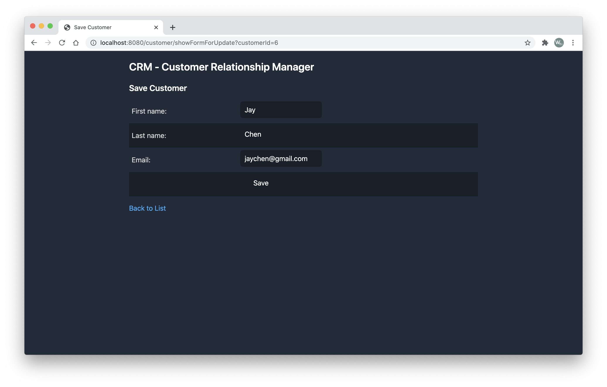

# Customer Tracker

## Environment

```
Java            11
Spring          5
MySQL Workbench 8.0.20
```

## How to Run the App

### Prework - Run the following script in MySQL Workbench

1. Create Users and Privileges in MySQL

   ```sql
   CREATE USER 'customer_tracker_admin'@'localhost' IDENTIFIED BY 'customer_tracker_admin';
   GRANT ALL PRIVILEGES ON * . * TO 'customer_tracker_admin'@'localhost';
   ALTER USER 'customer_tracker_admin'@'localhost' IDENTIFIED WITH mysql_native_password BY 'customer_tracker_admin';
   ```

2. Create `customer_tracker` database

   ```sql
   CREATE DATABASE  IF NOT EXISTS `customer_tracker`;
   USE `customer_tracker`;

   -- Table structure for table `customer`
   DROP TABLE IF EXISTS `customer`;
   CREATE TABLE `customer` (
     `id` int(11) NOT NULL AUTO_INCREMENT,
     `first_name` varchar(45) DEFAULT NULL,
     `last_name` varchar(45) DEFAULT NULL,
     `email` varchar(45) DEFAULT NULL,
     PRIMARY KEY (`id`)
   ) ENGINE=InnoDB AUTO_INCREMENT=6 DEFAULT CHARSET=latin1;

   -- Dumping data for table `customer`
   LOCK TABLES `customer` WRITE;

   INSERT INTO `customer` VALUES
     (1,'David','Adams','david@luv2code.com'),
     (2,'John','Doe','john@luv2code.com'),
     (3,'Ajay','Rao','ajay@luv2code.com'),
     (4,'Mary','Public','mary@luv2code.com'),
     (5,'Maxwell','Dixon','max@luv2code.com');

   UNLOCK TABLES;
   ```

### Clone the project

1. Set Tomcat Server
2. Set Facets and Artifacts
3. Reload All Gradle Projects
4. Run the app in browser

## Screenshots

### List (Read)



### Delete



### Search



### Update/Create


